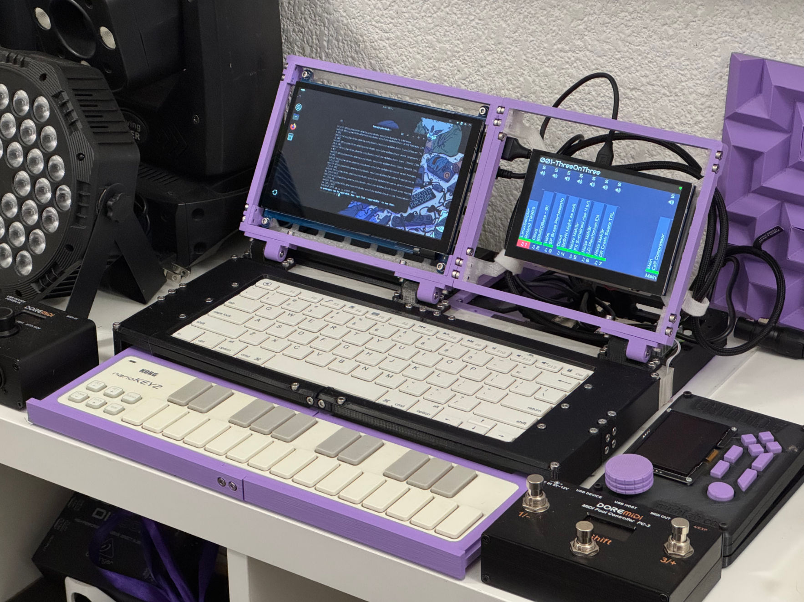
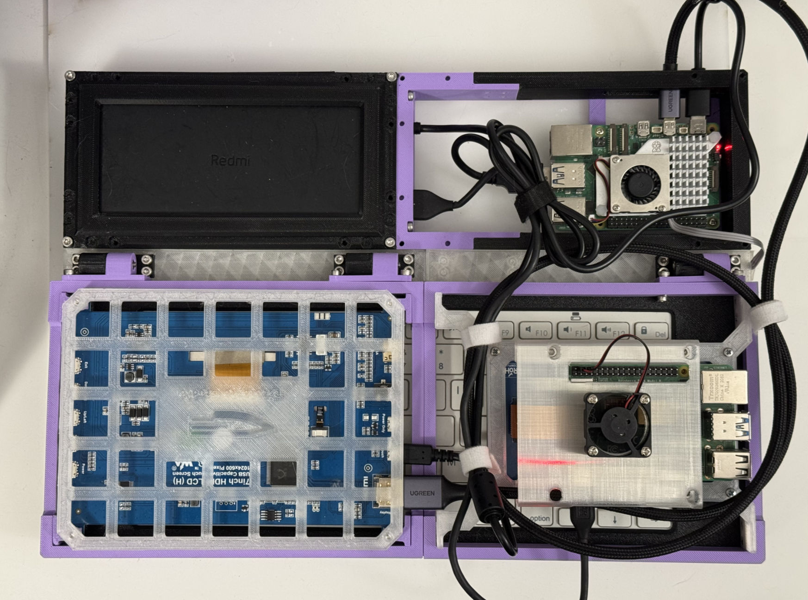

# cyberdeck
Este Cyberdeck forma parte del proyecto Síndrome de Estocolmo II: Resistir y Transitar el espacio público. Puedes conocer mas sobre mis proyectos en [lumaescalpelo.com](lumaescalpelo.com).

Al diseñar este cyberdeck pensaba en un dispositivo que pudiera usar comodamente en toda clase de situaciones, pero también pensé en que fuera particulamente bueno para algo. El diseño está pensado de forma modular para poder actualizar o adaptar cualquier parte segun mis necesidades.

## Materiales Cyberdeck
- Raspberry Pi 5 8GB
- MicroSD U3 256 GB
- Korg NanoKey2
- Teclado Miniso BLE 3.0
- Xiaomi Redmi Power Bank 20000mAh
- Pantalla LCD 7in
- Cable HDMI-MicroHDMI
- Cable USB-C
- Cable MiniUSB
- Piezas en Impresión 3D
- Tornillos M3x6 y M3x12

## Materiales Módulo Micro Visuales
- Pantallas OLED 128x64
- ESP32 DevKitV1
- Protoboard Mini
- Base en impresión 3D
- Tornillos M3x6

## Mareriales Módulo Zynthian
- Pantala Waveshare DSI 5in 
- Raspberry Pi 4 8GB
- Memoria MicroSD U3 128 GB